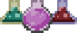

##  Escape Room

The project is being developed with Java Version 14, using JavaFX in combination with CSS.

##  How to start the application

The application is seperated into two parts. 
- The directory pointnclick_Game is the game itself,
- The directory pointnclick_Server is the Server, which is being hosted online.

The main class for the game is located in **pointnclick_Game/.../gui/Main.java**. Run Main.java to start the application.

__________________________________________________________________________________

Current technologies / 3rd party libraries - Click to unfold

__________________________________________________________________________________

**pointnclick_Game**
- Spring Framework - IoC, Dependency Injection
- Jackson-databind - JSON Processing
- Java.net.http - Client
- JUnit4 - Unit Tests
- Log4j - Logging
- JavaFX - GUI

**pointnclick_Server**
- Spring Boot - Webserver
- JDBC + PostgreSQL - Database
- Heroku.com - Webhost

##  MVP (Minimum Viable Product)

The development of a point and click game, which allows users to collect and use items to end the game.
